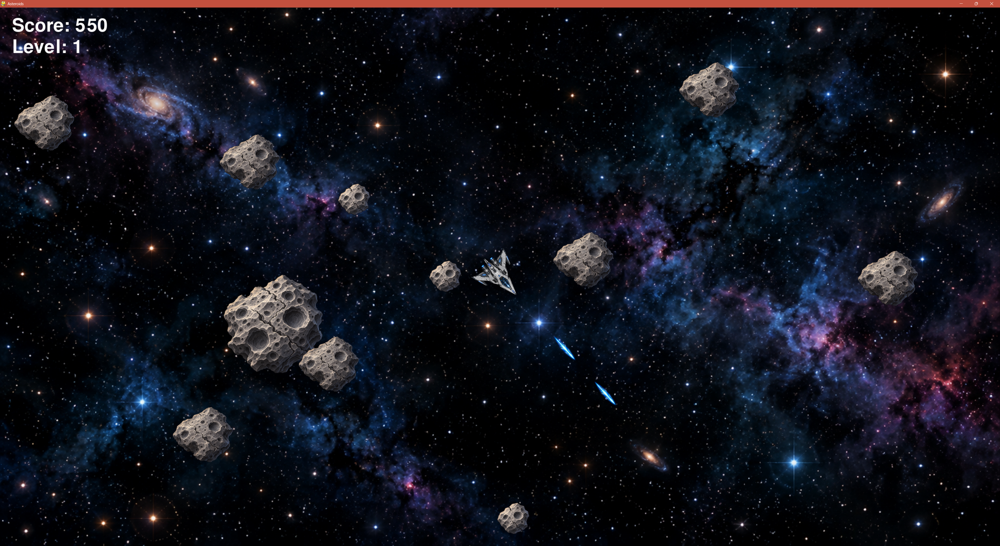

# Asteroids Game

Ein kleines Asteroids-Spiel in Python mit Pygame: Steuere ein Raumschiff, zerstöre Asteroiden, sammle Punkte und überstehe immer schwierigere Wellen.

## Game Preview

<p align="center">
  
</p>

## Funktionen in v1.0.0

- Asteroiden in drei Größen: Große und mittlere Asteroiden zerfallen beim Treffer jeweils in zwei kleinere.
- Punkte je zerstörtem Asteroiden: groß **20**, mittel **50**, klein **100**.
- Aufeinanderfolgende Level mit mehr und schnelleren Asteroiden.
- Fenstergröße zur Laufzeit änderbar; auch Vollbild wird unterstützt. Sprites und Bewegungen passen sich der Anzeigegröße an.
- Pause und Neustart nach Game Over.
- Grafiken für Schiff, Asteroiden, Laser und Weltraumhintergrund sowie ein Lasersound.

## Voraussetzungen und Start

- Python 3 mit `pip`
- Eine grafische Desktop-Umgebung mit Audioausgabe für Pygame

```bash
git clone https://github.com/Seebusch/Asteroids_Game.git
cd Asteroids_Game
python -m venv .venv
```

Virtuelle Umgebung aktivieren:

| System | Befehl |
| --- | --- |
| Windows PowerShell | `.venv\Scripts\Activate.ps1` |
| macOS / Linux | `source .venv/bin/activate` |

Anschließend:

```bash
python -m pip install -r requirements.txt
python -m asteroids
```

Unter Windows kann `py` anstelle von `python` nötig sein. Der Startbefehl wird im Repository-Verzeichnis ausgeführt.

## Steuerung

| Taste | Funktion |
| --- | --- |
| `←` / `→` | Raumschiff drehen |
| `↑` | Beschleunigen |
| `Leertaste` | Einen Laserschuss abgeben |
| `P` | Pausieren / fortsetzen |
| `R` | Nach Game Over neu starten |
| `F11` oder `Alt` + `Enter` | Vollbild umschalten |
| `Esc` | Spiel beenden |

Schiff und Asteroiden erscheinen nach dem Verlassen des Bildschirmrands auf der gegenüberliegenden Seite. Laserschüsse verschwinden am Bildschirmrand oder nach Ablauf ihrer Reichweite. Eine Kollision zwischen Schiff und Asteroid beendet den Durchlauf. Nach einer vollständig geräumten Welle beginnt das nächste Level.

## Projektstruktur

| Pfad | Inhalt |
| --- | --- |
| `asteroids/` | Spielschleife, Eingaben, Level, Punkte und Hilfsfunktionen |
| `models/` | Schiff, Asteroiden, Laser und gemeinsame Objektbasis |
| `assets/sprites/` | Bilddateien |
| `assets/sounds/` | Audiodateien |
| `ROADMAP.md` | Geplante Boni und weitere Verbesserungen |

## Geplant

Als nächste Erweiterungen sind **Bomben** zum Räumen eines Bereichs und **Multishot / Splitshot** für mehrere Projektile pro Schuss vorgesehen. Die konkrete Umsetzung, Spielbalance und weitere Ideen stehen in der [Roadmap](ROADMAP.md). Diese Boni sind noch nicht Bestandteil von v1.0.0.
